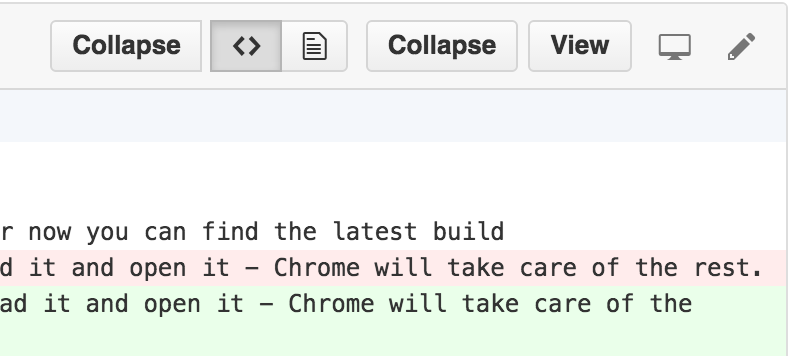

# better-pull-requests

## What is it?

It's a simple Chrome extension that adds a few niceties to GitHub and Bitbucket diff views.
The main idea is that it allows you to collapse the diff for a file to make
the page easier to navigate. It also adds the ability to hide comments in Bitbucket diffs.

## Features

The feature set is pretty small now (although useful). Note that these features should apply
to any GitHub or Bitbucket diff view (PRs, commit pages, branch comparisons, etc). If they don't, file an issue.

- Collapse/expand a single diff. (You can find the Collapse/Expand button in the file diff header,
	next to the View button.)
	
- Collapse a diff by using a button at the end of the file to avoid scrolling to the top. 
	(This will collapse the diff and position the page at the start of the next diff.)
- Collapse/expand all diffs at once. (You can find the Collapse All/Expand All buttons near the top
	of the page near the table of contents, next to the Unified/Split button group.)
- Jump to a file and expand the diff. (You can do this by clicking `X changed files` near the top,
    then clicking on the name of the file you want to jump to.)
- Hide the comments inside of a diff view. (Bitbucket only. GitHub has this natively.)
- Hide the comments for every diff view. (Bitbucket only for now. Coming to GitHub soon.)

## Bugs & Feature Requests

Just file an issue for any bugs for feature requests. If you want it, file an issue.
We'll weed them out as necessary.

## Installation

It can be found in the Chrome web store [here](https://chrome.google.com/webstore/detail/better-pull-requests/ioaepkkioliomgmnhkgkhcdoofgihhcc).

It can also be installed manually. You can find the latest build in the repository (`better-pull-requests.crx`).
Just download it and open it - Chrome will take care of the rest.
If for some reason Chrome won't allow you to install the extension by opening it (likely due to Chrome
security/development settings), open the Chrome extensions page then drag-and-drop the extension file onto the page.